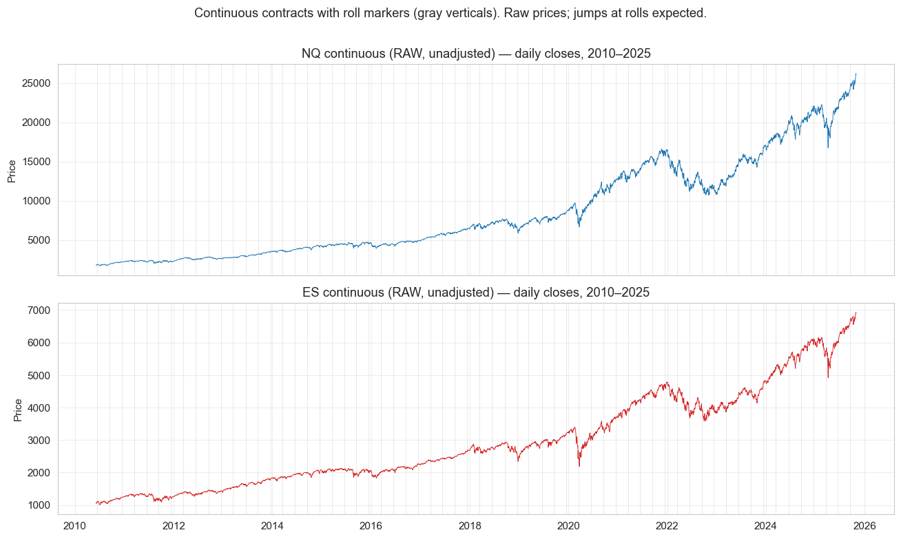
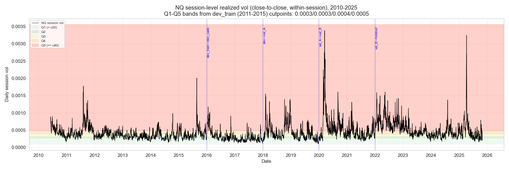
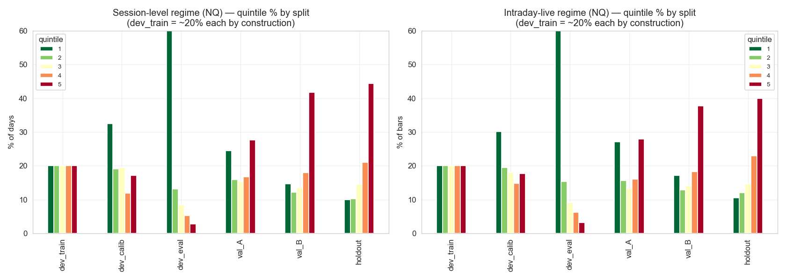
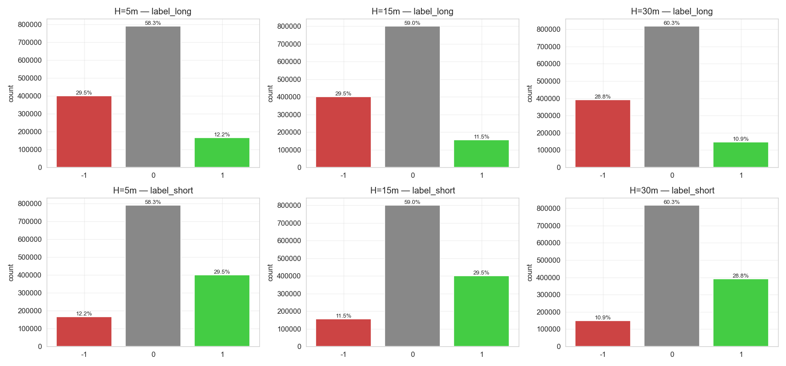
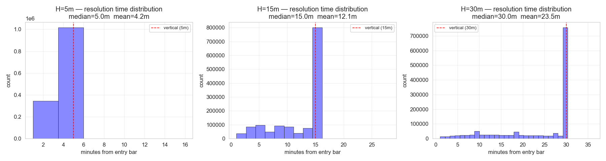
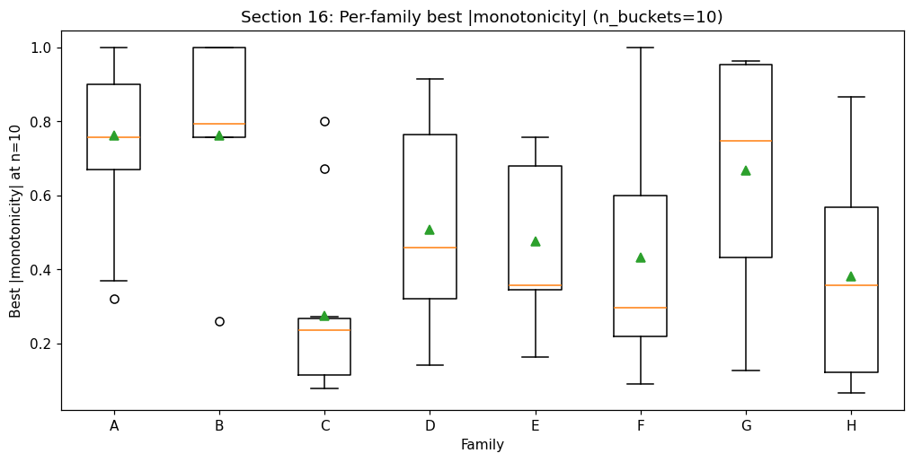
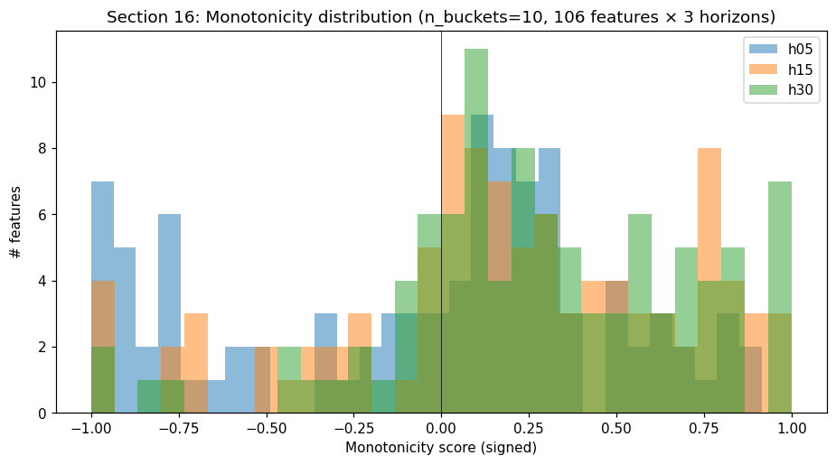
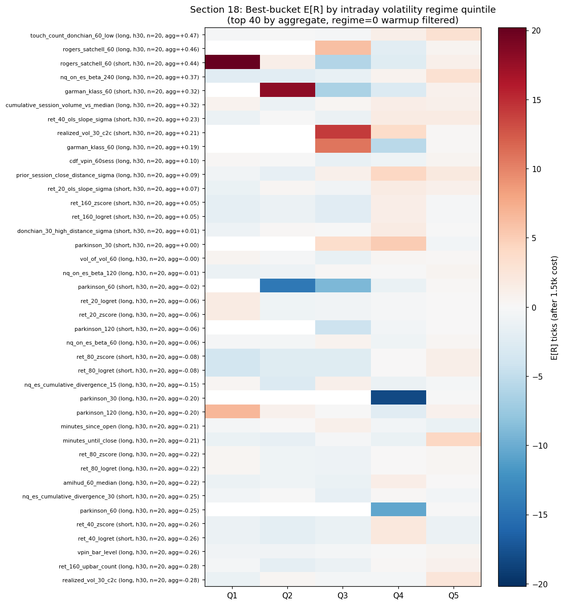
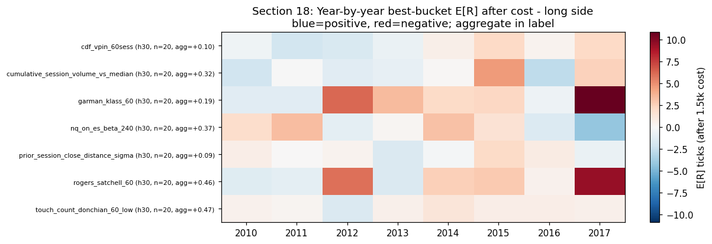
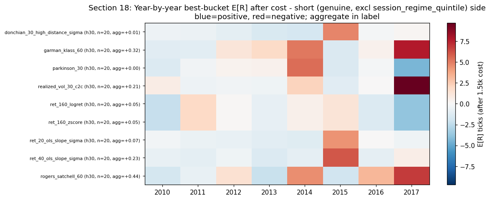

# NQ Microstructure Program Null Case Study

## Plain English Summary

This was a serious research attempt on NQ futures. The goal was not to make a pretty backtest. The goal was to ask a hard question:

> Is there enough real intraday signal in 1-minute NQ futures data to justify building a trading model after realistic retail trading costs?

The answer for version 1 was **no**.

That is why this is called a **program null**. It means the research did not clear its own evidence standard, so the correct decision was to stop instead of forcing the result to look positive.

To me, this is the most important part of the project. A lot of trading research becomes dangerous because the researcher keeps changing rules until the chart looks good. This project did the opposite: it built a rule-based research process, tested the idea, found some conditional signal, but rejected the full program when the strong evidence was not enough.

## What I Was Trying To Learn

Market microstructure is about the small mechanics of how markets move: session behavior, volatility regimes, order-flow pressure, range breaks, time of day, and how price reacts over short horizons.

For this project, I wanted to test whether basic 1-minute OHLCV data could reveal useful NQ intraday patterns. The research looked for signals such as:

- Does short-term momentum continue after the market opens?
- Do extreme moves revert after liquidity gets stretched?
- Does volatility regime change which signals work?
- Do NQ and ES divergences contain useful information?
- Do volume and toxicity-style proxies tell us when the market is unstable?
- Are any of these patterns still meaningful after trading costs?

The important phrase is **after trading costs**. A pattern that works before cost but disappears after cost is not a trading edge.

## Research Workflow

This was a literature-guided and heavily LLM-assisted research program.

I gathered research papers, PDFs, market microstructure references, and prior empirical findings, then used them as decision points for what to test next. LLMs were used heavily for implementation support, debugging, cross-checking, audit-style reasoning, and code review.

My role was to:

- Decide the research direction.
- Choose which market concepts and sources mattered.
- Define the feature families and validation gates.
- Interpret outputs and failure modes.
- Keep the process honest when results were not strong enough.
- Stop the program instead of loosening the rules until it looked good.

So the coding was strongly AI-assisted, but the research framing, judgment, and stop/go decisions were the real work.

## Research Design

| Area | Detail |
| --- | --- |
| Market | NQ futures, with ES used for cross-asset context. |
| Data | 1-minute OHLCV futures data, 2010-2025. Raw data is not included in this repository. |
| Cost assumption | 1.5 ticks all-in retail cost. |
| Feature set | 106 features across 8 families. |
| Labeling | Triple-barrier labels across 5, 15, and 30 minute horizons. |
| Split discipline | Chronological development, validation, and holdout periods with embargo. |
| Program size | 28 planned sections. Sections 1-19 were built; sections 20-28 were not built because the hard gate failed first. |

## Feature Families In Human Terms

The project grouped indicators into families so the model would not depend on one narrow trick.

| Family | Plain Meaning | Example Question |
| --- | --- | --- |
| A: Drift | Recent direction and short-term momentum. | If NQ has been moving up, does it continue? |
| B: Reversion | Stretched moves away from local fair value. | If price is far from VWAP, does it snap back? |
| C: Volatility state | How unstable the market is right now. | Do high-volatility states behave differently? |
| D: Range / breakout | Opening range, Donchian levels, range touches. | Do breaks of important intraday levels matter? |
| E: Volume | Participation and unusual volume. | Does abnormal volume confirm or reject a move? |
| F: Calendar / time of day | Session phase and clock-time behavior. | Are some parts of the day structurally different? |
| G: NQ vs ES | Cross-asset relative behavior. | Does NQ diverging from ES tell us anything? |
| H: Toxicity proxies | VPIN/BVC-style pressure proxies from bar data. | Is one-sided flow linked to future instability? |

## Research Pipeline

The program was built as a staged pipeline:

1. Load and clean ES/NQ intraday futures data.
2. Filter for regular trading hours and early-close days.
3. Build continuous contract handling without inventing fictional adjusted prices.
4. Create volatility regimes using development-only cutpoints.
5. Create triple-barrier labels for forward outcomes.
6. Build 106 candidate features across 8 families.
7. Screen each feature by bucket behavior, expected return after cost, yearly stability, and regime behavior.
8. Classify candidates as strong, conditional, weak, or dead.
9. Stop if the candidate pool is not strong enough.

The program stopped at step 8.

## Gate Result

The hard gate required enough strong candidates to justify building a downstream ensemble. The idea was simple: if the raw ingredients are not good enough, do not build a complicated model on top of them.

| Requirement | Result | Status |
| --- | ---: | --- |
| Strong candidates | 3 / 5 required | Fail |
| Conditional candidates | 44 / 5 required | Pass |
| Families represented | 8 / 4 required | Pass |

Final result: **hard gate failed**.

The strongest candidates were real enough to study, but not broad enough to justify the next stage. They clustered mostly around tail-volatility mean reversion. That is interesting, but it is not enough for a robust multi-family model.

The downstream validation, DSR, and one-shot holdout gates were never touched. That preserved clean out-of-sample data for a future version.

## Main Finding

Version 1 did not fail because there was no signal anywhere. It failed because the signal was not strong and diverse enough under the constraints.

The clearest lessons:

- 1-minute OHLCV data may be too compressed for some microstructure questions.
- A 1.5-tick retail cost assumption is a very high bar for short-horizon futures signals.
- The conditional pool was healthy, especially in high-volatility regimes.
- The strong pool was too small and too concentrated.
- More parameter tuning was not the right answer.

The better next step would be changing the research constraints: lower effective cost, richer order book or tick data, broader cross-asset structure, or a different labeling framework.

## Selected Diagnostics

### Continuous Contract And Roll Awareness

This chart helped verify that the data had visible contract-roll behavior. In futures data, roll handling matters because contracts expire and liquidity moves to the next contract. If this is handled badly, the research can accidentally learn roll artifacts instead of market behavior.

### Daily Volatility Regime Cutpoints

This chart shows how daily session volatility was split into regimes. The idea is simple: a calm day and a panic day should not be treated as the same market. The model should know whether it is operating in low, medium, or high volatility.

### Regime Distribution By Split

This chart shows that the volatility mix changed across time periods. That is important because a signal can look good in one environment and then disappear when the market regime changes.

### Triple-Barrier Label Distribution

Labels tell the research what happened after a potential entry: did price hit the upside barrier, downside barrier, or neither? This chart checks whether the label setup produced usable outcomes rather than a broken or badly imbalanced target.

### Resolution Time Distribution

This chart shows how quickly trades would resolve under the labeling setup. That matters because a short-horizon signal that takes too long to resolve may not really be a short-horizon signal.

### Per-Family Screening Quality

This boxplot compares feature families by how ordered their bucket behavior was. In plain terms: if a feature is useful, stronger readings should often line up with stronger outcomes. Some families showed structure, but structure alone was not enough after costs.

### Monotonicity Distribution

This histogram gives a broader view of how many feature tests had clean ordered behavior. It helped prevent cherry-picking one attractive feature while ignoring the full distribution.

### Regime-Conditional Candidate Heatmap

This was one of the most useful diagnostics. Many candidate effects were not stable everywhere. They showed up under specific volatility regimes. That made the signal interesting, but also more conditional and fragile.

### Yearly Positive Long Candidates

This heatmap helped check whether long-side candidates worked across years or only in isolated periods. A feature that works in one year and dies everywhere else is usually not enough.

### Yearly Positive Short Candidates

The same idea applies to short-side candidates. The point was not to find one attractive square on a heatmap. The point was to ask whether the pattern survived across enough years to deserve trust.

## What This Demonstrates

- Ability to turn market concepts into testable research.
- Data cleaning and quality checking before strategy logic.
- Awareness of futures-specific issues such as rolls, sessions, early closes, and event days.
- Cost-aware expected return thinking.
- Split discipline and protection of validation/holdout periods.
- LLM-assisted implementation with human-owned research judgment.
- Honest rejection of a weak research path.

## What This Does Not Claim

- It does not claim a live trading edge.
- It does not publish a production trading system.
- It does not include raw data, credentials, or private working artifacts.
- It does not prove that NQ futures are untradeable.
- It only rejects this version-1 research design under these constraints.

## Why I Kept It In The Portfolio

This is not the flashiest project, but it may be the most honest one.

It shows that I can use coding tools and LLMs to execute a serious research workflow, while still keeping the important part human: deciding what question matters, what evidence is enough, and when to stop.
