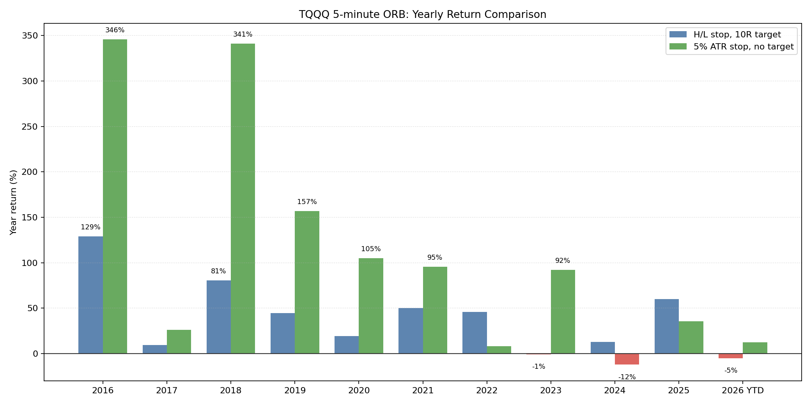

# TQQQ Opening Range Breakout Replication

## Plain English Summary

This case study summarizes a 5-minute Opening Range Breakout (ORB) replication/adaptation on TQQQ using Alpaca 1-minute data.

The idea is simple:

> Watch the first few minutes after the market opens, use that early move to set trade direction, then manage the trade with a defined stop model.

The results were very strong, especially for the ATR-stop version. Because the result is unusually strong, I do not treat this as a finished trading system. I treat it as a promising replication result that deserves stricter follow-up validation.

## Attribution

The working notebook credits Mohamed Gabriel / Concretum Group and references the paper *Can Day Trading Really Be Profitable?* as the motivating research source.

My work here was to run, adapt, inspect, and interpret the notebook inside my broader trading research portfolio. The raw notebook is not published because it contained hard-coded Alpaca API credentials and upstream source material. This public case study keeps the useful research summary, chart, results, and caveats without exposing credentials or republishing the full working notebook.

## Why This Study Is Interesting

ORB is attractive because it does not require complicated prediction. It asks whether the opening auction and early session imbalance contain enough information to justify a trade.

TQQQ makes the study more dramatic because it is a 3x leveraged Nasdaq-100 ETF. That means:

- Winning periods compound very quickly.
- Drawdowns can also become severe.
- A strategy can look spectacular while still being hard to trade psychologically.
- Risk controls matter more than the headline return.

That is why I include both the strong result and the caveats.

## Setup

| Area | Detail |
| --- | --- |
| Instrument | TQQQ, a 3x leveraged Nasdaq-100 ETF. |
| Data provider | Alpaca SIP 1-minute data. |
| Backtest period | 2016-01-04 to 2026-04-20. |
| Trading days | 2,588. |
| Intraday bars | 999,581 after early-close filtering. |
| Starting equity | $5,000. |
| Risk model | 1% equity risk per trade, max leverage 4x. |
| Commission assumption | $0.0005 per share. |
| Opening range | First 5 minutes. |

## Strategy Logic

1. Observe the first 5 minutes of the regular trading session.
2. Compare the first opening-range open to the fifth-minute close.
3. If the opening range closes up, bias long. If it closes down, bias short.
4. Enter on the next bar.
5. Test two stop/exit models:
   - **H/L stop:** use the opening-range high or low as the stop, with a 10R profit target.
   - **ATR stop:** use a stop based on 5% of lagged daily ATR%, with no profit target and exit at close.
6. Size each trade using fixed fractional risk.

The point of testing two stop models was to compare trade management, not just direction. Direction can be the same, but the stop and exit model can completely change the equity curve.

## Results

| Variant | Final AUM | Total Return | CAGR | Volatility | Sharpe | Max Drawdown |
| --- | ---: | ---: | ---: | ---: | ---: | ---: |
| H/L stop, 10R target | $145,864 | 2,817.29% | 38.90% | 38.07% | 1.05 | -37.72% |
| 5% ATR stop, no target | $3,565,155 | 71,203.10% | 89.64% | 61.32% | 1.32 | -55.83% |

## Equity Curve

The ATR-stop version dominates the full-period equity curve, but it also carries much higher volatility and a deeper max drawdown. The chart marks an out-of-sample region starting around 2023-02-17, but I do not present this as a fully independent research-grade holdout.

The honest interpretation is:

- The result is promising.
- The behavior is worth further research.
- The current public case study is not enough to claim production readiness.

## Yearly Return Comparison

The annual return chart is useful because it shows the path behind the headline number. The ATR-stop version had huge years, especially in 2016 and 2018, but it also had a negative 2024. This matters because a strategy can have a strong long-term result while still being difficult to sit through in weaker periods.

## What I Learned

- A simple opening-window idea can produce meaningful structure.
- Stop design can matter as much as signal direction.
- TQQQ can amplify both opportunity and risk.
- Full-period CAGR can hide uncomfortable drawdowns and regime dependence.
- Strong results need stricter validation, not louder marketing.

## Why This Is Useful For The Portfolio

This project is easy to understand even for a non-technical reader: opening behavior, defined stop, equity curve, yearly returns, caveats.

It also shows practical skills:

- Working with market data APIs.
- Handling intraday data and early-close filtering.
- Comparing strategy variants.
- Reading performance metrics beyond headline return.
- Communicating why a strong result still needs follow-up work.

## Caveats

- TQQQ is leveraged, so the strategy is structurally aggressive.
- Full-period compounding can make results look extreme.
- Commission is modeled, but slippage and execution assumptions need more stress testing.
- The result should be tested across additional providers, tickers, parameters, and explicit walk-forward splits.
- The working notebook had hard-coded Alpaca credentials; credentials should always be stored in environment variables and rotated if exposed locally.
- This is a replication/adaptation study, not an original academic paper or production system.

## Follow-Up Work

- Add separate in-sample and out-of-sample tables.
- Run parameter sensitivity around opening-range length, ATR multiplier, risk size, and target.
- Compare TQQQ against QQQ and other leveraged ETFs.
- Add slippage stress tests and delayed-entry tests.
- Publish a fully sanitized notebook only after credentials, attribution, and reproducibility are cleaned up.
