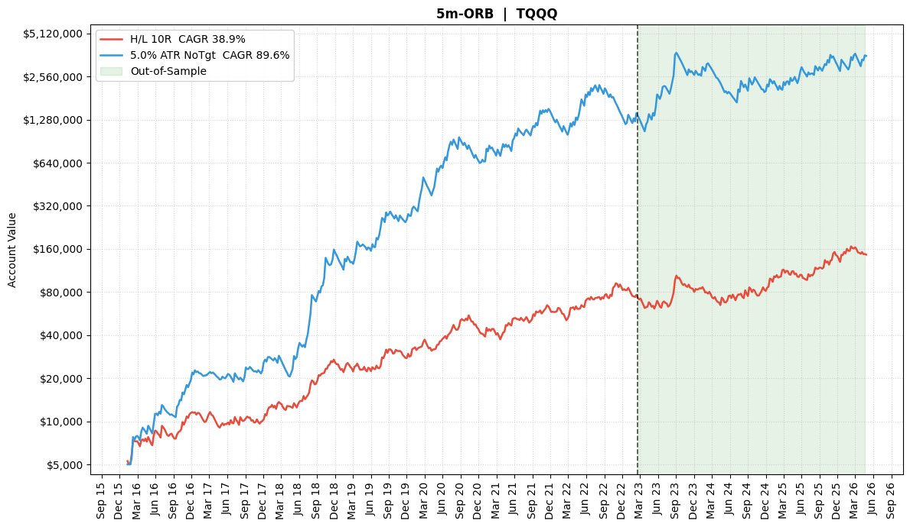

# TQQQ Opening Range Breakout Replication

## Summary

This case study summarizes a replication/adaptation notebook for a 5-minute Opening Range Breakout (ORB) strategy on TQQQ using free Alpaca intraday data.

The notebook produced very strong historical results, especially for the ATR-stop variant. Because the result is unusually strong, I am treating it as an exploratory replication study rather than a live-trading claim.

## Attribution

The working notebook credits Mohamed Gabriel / Concretum Group and references the paper *Can Day Trading Really Be Profitable?* as the motivating research source. My work here was to run, adapt, inspect, and interpret the notebook in the context of my broader trading research portfolio.

The raw notebook is not published here because it contained hard-coded Alpaca API credentials and upstream author/source material. This public case study keeps the research summary, results, and caveats without exposing credentials or republishing the full working notebook.

## Setup

| Area | Detail |
| --- | --- |
| Instrument | TQQQ, a 3x leveraged Nasdaq-100 ETF. |
| Data provider | Alpaca SIP 1-minute data. |
| Backtest period | 2016-01-04 to 2026-04-20. |
| Trading days | 2,588. |
| Intraday bars | 999,581 after early-close filtering. |
| Starting equity | $5,000. |
| Risk model | 1% equity risk per trade, max leverage 4x. |
| Commission assumption | $0.0005 per share. |
| Opening range | First 5 minutes. |

## Strategy Logic

1. Observe the first 5 minutes of the session.
2. Determine direction from opening-range net direction.
3. Enter on the next bar.
4. Test two stop models:
   - H/L stop: opening-range high/low stop, 10R target.
   - ATR stop: stop width based on 5% of lagged daily ATR%, no profit target, hold to close.
5. Size positions using fixed fractional risk.

## Results

| Variant | Final AUM | Total Return | CAGR | Volatility | Sharpe | Max Drawdown |
| --- | ---: | ---: | ---: | ---: | ---: | ---: |
| H/L stop, 10R target | $145,864 | 2,817.29% | 38.90% | 38.07% | 1.05 | -37.72% |
| 5% ATR stop, no target | $3,565,155 | 71,203.10% | 89.64% | 61.32% | 1.32 | -55.83% |

## Equity Curve

The chart marks an out-of-sample region starting around 2023-02-17, but the current public case study does not claim a fully independent research-grade holdout. It is best read as a promising replication result that deserves stricter follow-up validation.

## Why This Is Useful

- Shows ability to work with free institutional-style market data APIs.
- Demonstrates session-based intraday strategy logic.
- Compares stop/exit models instead of relying on one parameter set.
- Highlights the importance of data-provider differences, leverage, path dependency, and compounding.
- Adds a cleaner ETF-based ORB study alongside the futures and microstructure work.

## Caveats

- TQQQ is a leveraged ETF, so results are not directly comparable to futures, spot crypto, or unlevered equity ETFs.
- Full-period compounding can make headline returns look extreme.
- Commission is modeled, but broader execution assumptions and slippage sensitivity need stricter review.
- The result should be tested across additional providers, tickers, parameter ranges, and explicit walk-forward splits before being treated as robust.
- API credentials must never be hard-coded in public notebooks; use environment variables instead.

## Follow-Up Work

- Add separate in-sample / out-of-sample performance tables.
- Run parameter sensitivity around opening-range length, stop mode, ATR multiplier, and target.
- Compare against QQQ and other leveraged ETFs.
- Add explicit slippage stress tests.
- Remove any local/API assumptions from the working notebook before publishing code.
